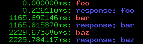
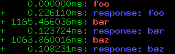
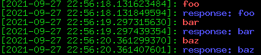
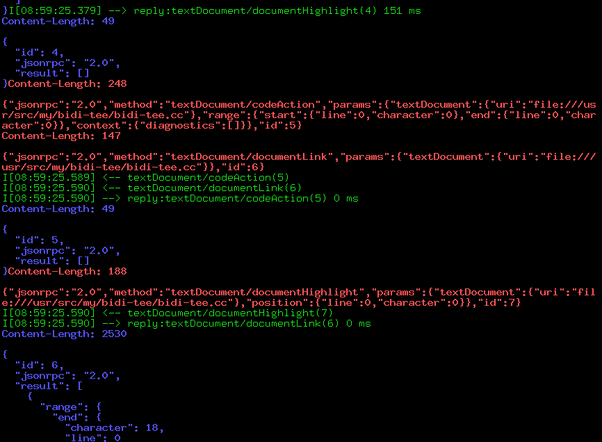

Bi-directional tee
==================

Bi-directional tee. Essentially observing bi-directional stdin/stdout/stderr
chatter while invoking a client program and while forwarding as usual like
a bi-directional pipe, but also writing all of them into a binary file
containing all channels and timestamps that then can be looked at with the
bidi-tee-print program.

Useful to debug communication with a subprocess communicating via stdin/stdout.

```
 bidi-tee /tmp/output.log -- other-program parameters to other program
```

The output in `/tmp/output.log` can then be printed using the `bidi-tee-print`
program, which allows to include timestamps, only selected channels...


```
Usage: bidi-tee-print [<options>] <bidi-tee-logfile>
-h            : this help
-c            : toggle print in color
-ts           : Print timestamp since start of recording.
-ta           : Print timestamps as absolute timestamps.
-td           : Print delta timestamps relative to last print
-s <select-channel> : comma-separated list of channels to print, e.g. 0,2 prints stdin and stderr
-o <filename> : Output to filename
```

### Timestamps
Timestamps can be printed with the `-t` option that is qualified with one of three letters:
`-ts` prints times since the start of the recording, `-td` prints relative time between outputs and `-ta`
prints absolute timestamps.

Start Timestamp  `-ts`   | Delta timestamp `-td`
-------------------------|-----------------------
  |

The `-ta` absolute timestamp prints the full timestamp with date and time



### Example

Here a practical example from a clangd session, observing what is going on
between emacs and clangd talking Language Server Protocol to each other.
(red: emacs talking to clangd, blue: clangd answering,
green: clangd stderr output).


